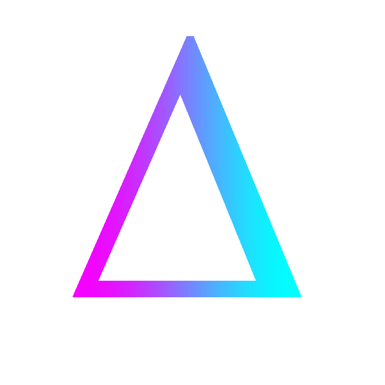

<h1 align="center">DeltaClient</h1>

A modified Minecraft client with the features you want.

---

    
     
    
    
    
     
    
    

---

# 🤖 Features

| Feature             | Implemented? |
|---------------------|--------------|
| Custom Font         | ✔            |
| Custom MainMenu     | ✔            |
| Server Ip Message   | ✔            |
| Custom Window Title | ✔            |

---
# 👀 Instructions
1. Download the latest release

2. Install mc-fabric for 1.20.2

3. Drag the Jar file into your mods folder

4. Start your fabric installation

5. Enjoy the day with DeltaClient 💜
---
# 💰 Donation

If you like my projects your free to donate:

Bitcoin Address: bc1qyvc8gyplf3nd8plpz0fw3chf3vs499cxcywypd

